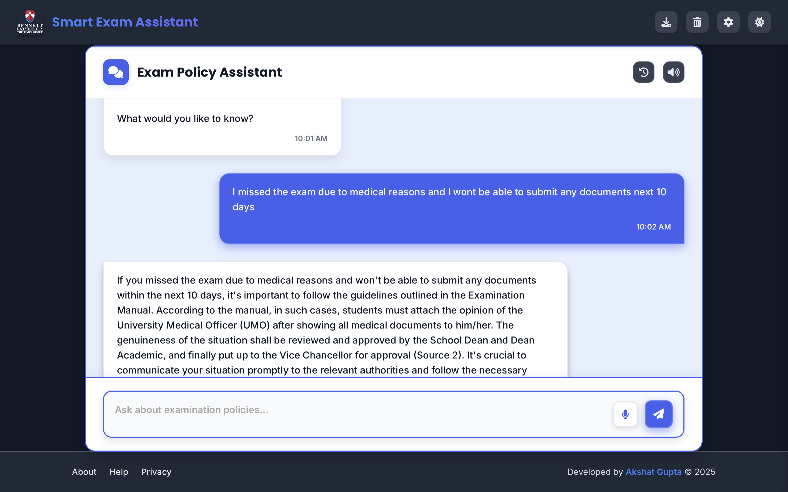

# Smart Exam Assistant

An AI-powered application for navigating Bennett University's examination policies and procedures using advanced Retrieval-Augmented Generation (RAG) technology, developed by Akshat Gupta.

## Overview

Smart Exam Assistant is a sophisticated web application that uses hierarchical Retrieval-Augmented Generation (RAG) to provide accurate and contextual answers to questions about examination policies. The application is built with Flask, Python, and modern web technologies, featuring an enhanced UI with animations and interactive elements.

## Features

- **Intelligent Q&A**: Get instant, accurate answers to questions about examination policies
- **Voice Input**: Speak your questions with support for Hindi and Hinglish
- **Text-to-Speech**: Listen to responses with an Indian accent
- **Enhanced UI**: Interactive animations and visual feedback
- **Conversation History**: Review and export your conversation history
- **Mobile-Friendly**: Use on any device with a responsive design

## RAG Architecture in Detail

After examining the codebase, I can provide a detailed explanation of the RAG implementation in this project:

### 1. Document Processing Pipeline (`extract_text_from_pdf` and `process_document` functions)

The Smart Exam Assistant uses a sophisticated hierarchical RAG system implemented in `app.py` to provide accurate answers from Bennett University's examination manual:

- **PDF Text Extraction**: The system extracts text from the examination manual PDF using PyMuPDF (fitz) in the `extract_text_from_pdf` function (lines 52-104). For image-based pages, OCR is applied using Tesseract to ensure complete text extraction:

```python
def extract_text_from_pdf(pdf_path):
    """Extract text from a PDF file, using OCR for image-based pages if available."""
    # ... PDF text extraction with OCR fallback for image-based pages
```

- **Text Chunking**: The extracted text is divided into manageable chunks (default: 800 characters with 200 character overlap) using LangChain's CharacterTextSplitter in the `process_document` function (lines 122-198):

```python
# Split text into chunks
text_splitter = CharacterTextSplitter(chunk_size=chunk_size, chunk_overlap=chunk_overlap)
chunks = text_splitter.split_text(text)
```

- **Summary Generation**: For each chunk, a concise summary is generated using OpenAI's GPT model in the `generate_summary` function (lines 106-120):

```python
def generate_summary(text, chunk_index):
    """Generate a summary for a chunk of text."""
    prompt = PromptTemplate(
        input_variables=["text"],
        template="Summarize the following text in 2-3 sentences, capturing key points:\n\n{text}\n\nSummary:"
    )
    # ... summary generation using OpenAI's GPT model
```

### 2. Vector Database (Chroma Implementation)

- **Dual-Collection Architecture**: The system maintains two Chroma vector collections in the `process_document` function:
  - **Summary Collection**: Stores embeddings of chunk summaries for efficient first-pass retrieval
  - **Chunk Collection**: Stores embeddings of the full text chunks for detailed information retrieval

```python
# Create Chroma vector stores
summary_store = Chroma.from_texts(
    texts=summaries,
    embedding=embeddings,
    collection_name=summary_collection_name,
    persist_directory=persist_directory,
    metadatas=summary_metadatas,
    collection_metadata={"hnsw:space": "cosine"}
)

chunk_store = Chroma.from_texts(
    texts=chunk_texts,
    embedding=embeddings,
    collection_name=chunk_collection_name,
    persist_directory=persist_directory,
    metadatas=chunk_metadatas,
    collection_metadata={"hnsw:space": "cosine"}
)
```

- **Embedding Model**: OpenAI's text-embedding-ada-002 model is used to create vector embeddings of both summaries and chunks (line 49):

```python
embeddings = OpenAIEmbeddings(api_key=api_key, base_url=base_url, model="text-embedding-ada-002")
```

- **Metadata Linking**: Each summary is linked to its corresponding chunk through a unique chunk_id, enabling the hierarchical retrieval process (lines 166-172):

```python
chunk_id = str(uuid.uuid4())
summary = generate_summary(chunk, i)
summaries.append(summary)
chunk_texts.append(chunk)
summary_metadatas.append({"chunk_id": chunk_id, "index": i})
chunk_metadatas.append({"chunk_id": chunk_id, "index": i})
```

### 3. Hierarchical Retrieval Process (`hierarchical_retrieval` function)

When a user asks a question, the system follows a two-stage retrieval process in the `hierarchical_retrieval` function (lines 200-225):

1. **Summary Search**: The query is converted to an embedding and used to search the summary collection:

```python
# Step 1: Search summaries
summary_retriever = summary_store.as_retriever(search_kwargs={"k": k * 2})  # Broader search for summaries
summary_docs = summary_retriever.invoke(query)
```

2. **Chunk Retrieval**: The system then retrieves the full text chunks corresponding to the most relevant summaries using the chunk_ids:

```python
# Step 2: Get corresponding chunks
chunk_ids = [doc.metadata.get("chunk_id") for doc in summary_docs if doc.metadata.get("chunk_id")]
# Query chunk store using chunk IDs
chunk_docs = chunk_store.get(where={"chunk_id": {"$in": chunk_ids}})
```

3. **Relevance Ranking**: The retrieved chunks are ranked by relevance to the query, and the top k chunks are selected for the response generation:

```python
return retrieved_docs[:k]  # Return up to k documents
```

### 4. Response Generation (`generate_response` function)

The response generation process is implemented in the `generate_response` function (lines 227-286):

- **Context Assembly**: The retrieved chunks are assembled into a context document with clear section markers:

```python
if docs:
    context_parts = []
    for i, doc in enumerate(docs):
        # Add source number and text with clear separation
        context_parts.append(f"SOURCE {i+1}:\n{doc['text']}")
    context = "\n\n".join(context_parts)
```

- **Conversation History Integration**: Previous conversation turns are included to maintain context across multiple questions:

```python
history_text = ""
if history:
    history_text = "Previous conversation:\n"
    for hist_query, hist_response in history[-max_history:]:
        history_text += f"User: {hist_query}\nAssistant: {hist_response}\n\n"
```

- **Prompt Engineering**: A carefully crafted prompt template instructs the LLM to use the conversation history and context effectively:

```python
prompt = PromptTemplate(
    input_variables=["history", "context", "question"],
    template=(
        "You are a chatbot assisting with Bennett University's Examination Manual. "
        "Your goal is to provide accurate, helpful information while maintaining proper context throughout the conversation.\n\n"
        "INSTRUCTIONS:\n"
        "1. Use the conversation history to understand the context of the current question\n"
        "2. Reference the provided context from the manual to answer accurately\n"
        "3. Maintain continuity with previous exchanges\n"
        "4. If the question relates to previous questions, acknowledge that relationship\n"
        "5. If information is missing from the context, clearly state that you don't have that specific information\n"
        "6. Always cite the relevant section from the manual when possible\n"
        "7. Be concise but complete in your response\n\n"
        "{history}\n\n"
        "CONTEXT FROM EXAMINATION MANUAL:\n{context}\n\n"
        "CURRENT QUESTION: {question}\n\n"
        "RESPONSE:"
    )
)
```

- **LLM Generation**: OpenAI's GPT model generates the final response based on the retrieved context and conversation history:

```python
chain = prompt | llm
response = chain.invoke({
    "history": history_text,
    "context": context,
    "question": query
}).content.strip()
```

### 5. Real-time Processing (Socket.IO Implementation)

The application uses Socket.IO to provide real-time updates during the retrieval and generation process:

- **Socket.IO Integration**: The application uses Socket.IO to handle real-time communication between the client and server (lines 460-691).

- **Progress Visualization**: Users see a visual representation of the RAG pipeline as their query is processed, with progress indicators for both retrieval and generation phases:

```python
@socketio.on('message')
def handle_message(data):
    # ... processing logic
    emit('processing', {'status': 'retrieving', 'progress': 30, 'message': 'Searching through summaries...'})
    # ... more processing
    emit('processing', {'status': 'retrieving', 'progress': 60, 'message': 'Finding relevant chunks...'})
    docs = hierarchical_retrieval(query, summary_store, chunk_store, k=2)
    # ... more processing
    emit('processing', {'status': 'generating', 'progress': 50, 'message': 'Formulating response...'})
    response = generate_response(query, docs, history)
    # ... send response to client
```

## User Interface Implementation

The user interface is implemented using HTML, CSS, and JavaScript with several key components:

### 1. Main Layout (`templates/layout.html`)

The main layout provides the structure for the application, including:
- Header with logo and controls
- Main content area
- Footer with attribution to Akshat Gupta
- Modal system for settings, about, help, and privacy

### 2. Chat Interface (`templates/index.html`)

The chat interface includes:
- Chat messages container
- Input area with voice input button
- Suggestion buttons for common questions
- Processing visualization overlay
- Chat history sidebar

### 3. JavaScript Functionality (`static/js/chat.js` and `static/js/voice-input.js`)

The JavaScript files handle:
- Socket.IO communication with the server
- Message sending and receiving
- Chat history management
- Voice input processing
- UI animations and interactions

### 4. Styling (`static/css/style.css` and `static/css/chat.css`)

The CSS files provide:
- Responsive layout
- Dark mode support
- Message styling
- Animation effects
- UI component styling

## Technology Stack

- **Backend**: Flask, Python, Socket.IO
- **Frontend**: HTML5, CSS3, JavaScript, GSAP (animations)
- **AI/ML**: OpenAI API (GPT-3.5, text-embedding-ada-002), LangChain
- **Vector Database**: Chroma DB (local persistence)
- **PDF Processing**: PyMuPDF, Tesseract OCR (optional)
- **Voice**: Web Speech API

## Installation

1. Clone the repository
2. Install dependencies:
   ```
   pip install -r requirements.txt
   ```
3. Set up environment variables in `.env` file:
   ```
   OPENAI_API_KEY=your_api_key
   PDF_PATH=./Examination-Manual-2024-25--2.pdf
   PERSIST_DIRECTORY=./chroma_db
   ```
4. Run the application:
   ```
   python app.py
   ```

## Usage

1. Open the application in your web browser at http://localhost:5001
2. Type or speak your question about examination policies
3. View the AI-generated response
4. Explore additional features like voice input, text-to-speech, and conversation history

## Application Screenshot

The screenshot below shows the Smart Exam Assistant interface with its key components:



Key features visible in the screenshot:
- Clean, modern user interface with dark mode support
- Chat message area showing conversation history
- Real-time processing visualization for RAG pipeline
- Voice input capability with speech recognition
- Suggestion buttons for common questions
- Chat history management

## Developer

**Akshat Gupta**

## License

This project is proprietary and confidential. All rights reserved.

© 2024 Akshat Gupta, Bennett University
